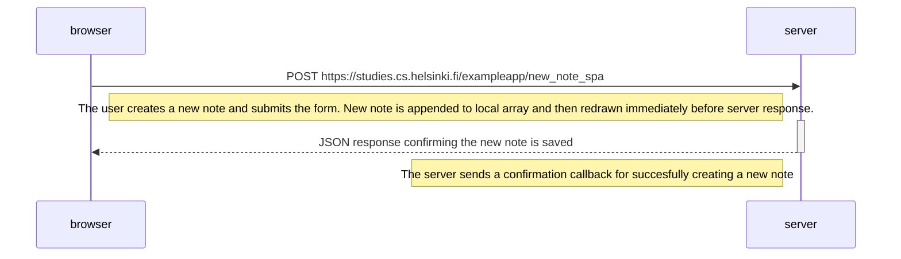

Side note: It is possible that the server doesn't return an OK201 signifying a succesfully created note. This could be due to disconnection during the post operation (or at any point after initially loading the page fully) thus meaning no response, and theoretically you should be able to also get a 4XX - 5XX range error although I didn't go out of my way trying to make that happen. Regardless of any of these outcomes, the spa would still update the local array first and render it despite having no confirmation if it actually ever made it to the server and what the server thinks of the post method used.